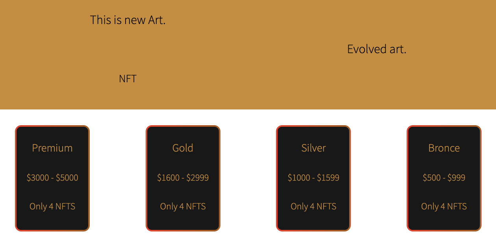

# BIENVENIDOS A NFT OPENTOART 

<p>  </img> </p>

## ¿De que se trata mi proyecto?

OPENTOART es una pagina web creada con el framework React con el objetivo de realizar todos los desafios del curso de programacion de REACT en CODERHOUSE. Implementando componentes con sus respectivas funciones y objetivos.

En este proyecto se pueden apreciar distintos tipos de categorias de NFTS, en la cual hay 2 NFTS por categoria, se pueden visualizar, ver el detalle de cada uno y sumarlo al carrito en caso de que se quiera realizar una compra.

## ¿Que tecnologias aplique en el proyecto?
[](https://skillicons.dev)

## Control de Versiones
[](https://skillicons.dev)

## Base de Datos
[](https://skillicons.dev)

## IDE
[](https://skillicons.dev)

## Librerias utilizadas.
- React Bootstrap
- React Icons
- React-router-dom


# Pasos para inicializar mi proyecto.

Clonamos el repositorio.

```
git clone https://github.com/tomasgiacobino/ReactGiacobino/tree/main/src
```
Instalamos todas las dependencias
````
npm install o npm i
````
Nos posicionamos en la carpeta
````
cd proyectotomi
````
Iniciar la app
````
npm start
````

# Contacto

- Linkedin: [Tomas Giacobino](https://www.linkedin.com/in/tomas-giacobino-8766a1234/)

- Email: tomas.giacobino@gmail.com

